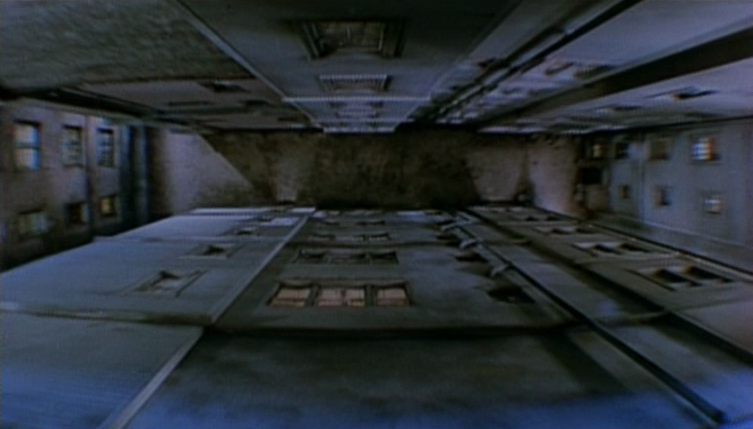

Vertigo allows you to treat raw bytes like a normal Clojure data structure.  This allows for faster reads and reduced memory footprint, and can also make interop with C libraries significantly simpler and more efficient.  With certain safety checks turned off, this yields performance a bit faster than Java arrays on a much wider variety of datatypes.

Full documentation can be found [here](http://ideolalia.com/vertigo).

### usage

[](https://travis-ci.org/ztellman/vertigo)

```clj
[vertigo "0.1.4"]
```

### defining a type

To define a typed structure, we use `vertigo.structs/def-typed-struct`:

```clj
(use 'vertigo.structs)

(def-typed-struct vec3
  :x float64
  :y int32
  :z uint8)
```

Each field is defined as a pair: a name and a type.  The resulting typed-struct can itself by used as a type:

```clj
(def-typed-struct two-vecs
  :a vec3
  :b vec3)
```

In the `vertigo.structs` namespace, there are a number of predefined primitive types, including `int8`, `int16`, `int32`, `int64`, `float32`, and `float64`.  Any integer type can be made unsigned by adding a `u` prefix, and all primitive types can have an `-le` or `-be` suffix for explicit endianness.  Without a suffix, the endianness will default to that of the underlying buffer.

We can also define a fixed-length n-dimensional array of any type using `(array type & dims)`:

```clj
(def-typed-struct ints-and-floats
  :ints (array uint32 10)
  :floats (array float32 10))
```

### creating a sequence

To create a sequence, we can either **marshal** an existing sequence onto a byte-buffer, or **wrap** an existing byte source.  To marshal a sequence, we can either use `vertigo.core/marshal-seq` or `vertigo.core/lazily-marshal-seq`:

```clj
> (require '[vertigo.core :as v])
nil
> (def s (range 5))
#'s
> (v/marshal-seq uint8 s)
(0 1 2 3 4)
```

While the marshaled seq is outwardly identical, under the covers it is just a thin object wrapping a 5 byte buffer.  In this case we could get an identical effect with an array, but this extends to types of any size or complexity:

```clj
> (def x {:ints (range 10), :floats (map float (range 10))})
#'x
> (v/marshal-seq ints-and-floats [x])
({:ints (0 1 2 3 4 5 6 7 8 9), :floats (0.0 1.0 2.0 3.0 4.0 5.0 6.0 7.0 8.0 9.0)})
```

Using `marshal-seq` will realize and copy over the entire sequence at once.  For large or unbounded sequences, `lazily-marshal-seq` is preferred.  While the performance characteristics of the two methods may differ, the resulting seq is otherwise the same.

To create a sequence that wraps an already encoded source of bytes, you may use `vertigo.core/wrap`.  Vertigo seqs created via `wrap` or `marshal-seq` can be turned back into bytes using `byte-streams/to-*` from the [byte-streams](https://github.com/ztellman/byte-streams) library.

### interacting with a sequence

While we can use `first`, `rest`, `nth`, `get-in` and all the other normal Clojure functions on these sequences, we can also do something other data structures can't.  Consider the above example of a map containing sequences of ints and floats.  To get the fifth element under the `:floats` key, we call `(get-in s [:floats 4])`.  This will first get the sequence under the `:floats` key, and then look for the fifth element within the sequence.

However, in our data structure we're guaranteed to have a fixed layout, so _we know exactly where the data is already_.  We don't need to fetch all the intermediate data structures, we simply need to calculate the location and do a single read.  To do this, we use `vertigo.core/get-in`:

```clj
> (def ^:int-and-floats s (v/marshal-seq ints-and-floats [x]))
#'s
> (v/get-in s [0 :floats 4])
4.0
```

Notice that we have hinted the sequence with the keyword `:ints-and-floats`.  To work with our compile-time `get-in`, all sequences must be hinted with their element type in this way.  In return, we get a read time that even for moderately nested structures can be several orders of magnitude faster.

Since everything's just bytes under the covers, we can also overwrite existing values.  While this isn't always necessary, it's certainly useful when you need it.  To write to the sequence, we may either use `vertigo.core/set-in!` or `vertigo.core/update-in!`:

```clj
> (def ^:int8 s (v/marshal-seq int8 (range 5)))
#'s
> (v/set-in! s [5] 42)
nil
> (v/update-in! s [0] - 42)
nil
> s
(-42 1 2 3 42)
```

### selecting sub-sequences

Calling something like `map` on a Vertigo sequence means that we can no longer use `vertigo.core/get-in`, `update-in!`, or any of the other special operators that only work on Vertigo sequences.  This is mostly unavoidable, but in the specific case where we simply want to pull out a subset of the sequence, we can hold onto these properties using `(over s fields)`:

```clj
> (require '[vertigo.structs :as s])
nil
> (def matrix (s/array s/int64 2))
#'matrix
> (marshal-seq matrix [[0 1] [2 3]])
((0 1) (2 3))
> (def s *1)
#'s

;; if we define both indices as 'free', then we see a flattened iteration over all elements
> (over s [_ _])
(0 1 2 3)

;; if we fix the first index, we only iterate over the first array
> (over s [0 _])
(0 1)

;; if we fix the second index, we only iterate over the first elements of each array
> (over s [_ 0])
(0 2)
```

A free variable is either `_` or anything that begins with `?`, like `?i` or `?a-gratuitously-long-name`.

### iterating over sequences

Since we can directly access the underlying memory, we can do very efficient iteration, but Clojure's normal iteration primitives use too many levels of indirection for us to realize this.

Instead, Vertigo provides `doreduce`, a primitive that is a fusion of Clojure's `doseq` and `loop`:

```clj
> (def ^:s/int64 s (marshal-seq s/int64 (repeat 100 1)))
#'s
> (doreduce [x s] [sum 0]
    (+ sum x))
100
```

Notice that `doreduce` takes two binding forms, one for sequences, and another for accumulators.  Unlike `loop`, the `recur` here is implicit; the value returned for one element is propagated to the next.  If we want to propagate multiple values, we simply return a vector:

```clj
> (doreduce [x s] [sum 0, product 1]
    [(+ sum x) (* product x)])
[100 1]
```

Note that we're not actually allocating a new vector for each element, it's just sugar over a multi-value recursion.

If we explicitly don't want to recur, we can use `break`:

```clj
> (doreduce [x s] [all-even? true]
    (if (odd? x)
      (break false)
      true))
```

We can iterate over multiple sequences in parallel:

```clj
> (doreduce [x s, y s] [sum 0]
    (+ x y sum))
200
```

We can also iterate over subsets of sequences using the `over` syntax:

```clj
> (doreduce [x (over s [?i])] [sum 0]
    (+ x ?i sum))
5050
```

Finally, we can set the `:step` and `:limit` for iteration:

```clj
> (doreduce [x s, :step 2, :limit 10] [sum 0]
    (+ x sum))
5
```

Or, if there are multiple iterators, `:steps` and `:limits`:

```clj
> (doreduce [x (over s [?i]), :steps {?i 2}, :limits {?i 10}] [sum 0]
    (+ x sum))
5
```

Common use cases are exposed as `vertigo.core/sum`, `every?`, and `any?`.

### turning off bounds checks

By default, every index is checked at compile time if possible, and runtime if necessary.  However, if your access patterns are predictable and no runtime exceptions are thrown, you can turn off bounds checking by adding `-Dvertigo.unsafe` as a command-line parameter.  When this is enabled, `(vertigo.core/sum s)` is ~10% faster than the equivalent operation using Clojure's `areduce`, and ~10x faster than `(reduce + array)`.

### when to use vertigo

Any long-lived data which has a fixed layout can benefit from Vertigo, both with respect to performance and memory efficiency.  However, sequences which contain sub-sequences of unpredictable length cannot be represented using Vertigo's structs, and sequences which are discarded after a single iteration won't be worth the trouble of calling `marshal-seq`.

### license

Copyright © 2013 Zachary Tellman

Distributed under the [MIT License](http://opensource.org/licenses/MIT)
